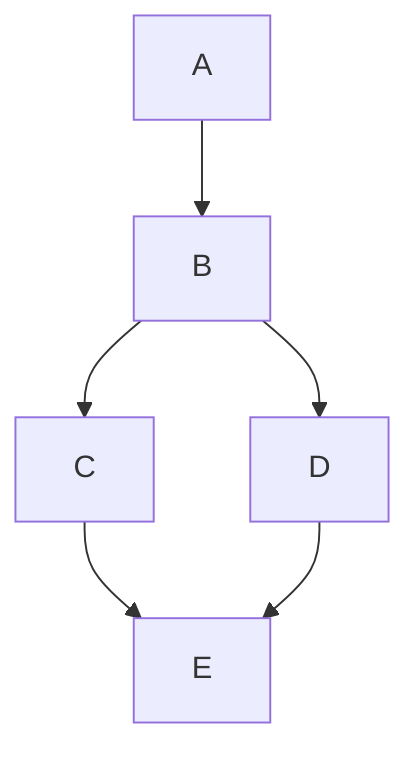
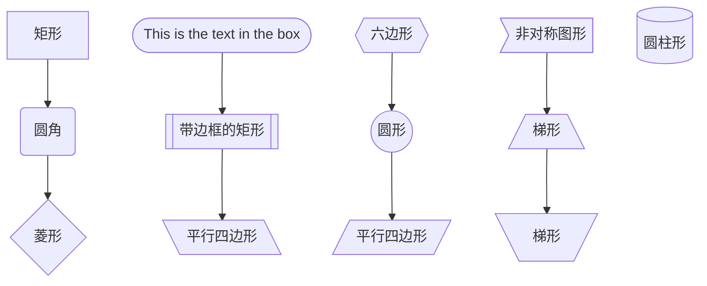
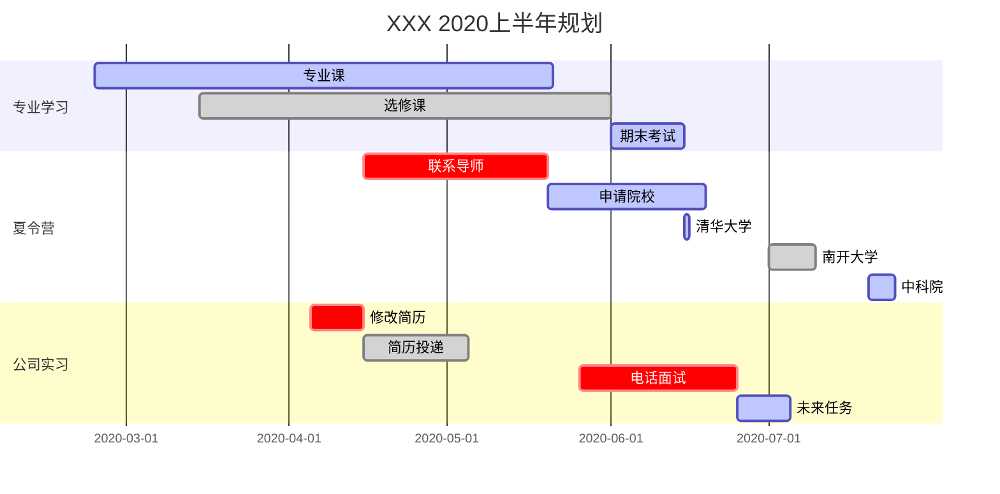

<center><font size=6>Online Markdown Editor</font></center>

# 一级标题

## 二级标题

### 三级标题

---

**重点加粗**

*斜体*

~~删除线~~

---

列表：

* 无序列表
* 无序列表

1. 有序列表
2. 有序列表
3. 有序列表

---

> 引用文本

---

这是 `行内代码` 语法。

代码块语法：

``` python
print("Hello，World!")
```

---

[超链接](链接地址)


---

表格：

| 表头 | 表头 |
| ---- | ---- |
| 内容 | 内容 |
| 内容 | 内容 |

---







